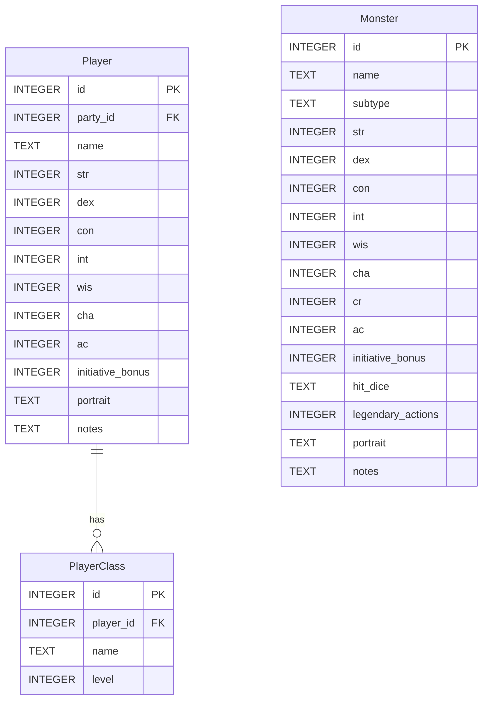

Dungeon Minion project brief
===========================

Summary
-------

Dungeon Minion is a desktop assistant for dungeon masters running Dungeons & Dragons 5e. The app runs locally, targets
power users, and is strictly a DM tool—players do not interact with it directly. The DM manages the game without
requiring player accounts, character sheet access, or any shared system that might impose trust overhead. Documentation
and plans will evolve iteratively for collaborative development and future open sourcing.

Core objectives
---------------

- Deliver a private, interactive DM window with complete game details alongside a player-facing window that mirrors
  the DM view with only player-appropriate information.
- Keep the entire experience offline first with local storage only.
- Prioritize the encounter perspective before other views.
- Enable power-user workflows with minimal friction.

Perspectives
------------

- Map: Display configured maps to players, highlight areas, add markers, and pursue routefinding as a stretch goal.
- Encounter: Track initiative, conditions, health, and lair actions; support undo, redo, and state saves.
- Trade: Manage buy and sell flows with totals, discounts, and curated item lists.
- Library: Organize campaign data, including maps, monsters, encounters, items, and player information.

Sidebar utilities
-----------------

- Dice calculator for complex rolls.
- Name generator for NPCs, monsters, and locations.
- Settings for global themes, displays, and data management.

Architecture decisions
----------------------

- Use Tauri with SvelteKit for cross-platform delivery.
- Maintain multiple windows in one process, do not overcomplicate window management with multiple apps.
- Implement the shared data model in Rust with `sqlx` for SQLite access.
- Favor forms-on-tables UI patterns for data entry.

### Frontend architecture (MVVM) ###

The frontend follows Model-View-ViewModel separation:

- **Views** are Svelte components (e.g., `ParticipantRow.svelte`). They handle layout, styling, and user interaction.
  Views bind to ViewModels and should not call Tauri commands directly.

- **ViewModels** are TypeScript classes (e.g., `ParticipantViewModel.ts`, `MonsterViewModel.ts`). They wrap model data,
  expose computed properties for display, and mediate all Tauri command invocations. Views call ViewModel methods;
  ViewModels call commands.

- **Models** are the Rust↔TypeScript contract. Rust structs in `src-tauri/src/` (e.g., `participant.rs`) serialize via
  serde to matching TypeScript interfaces in `src/lib/model/` (e.g., `Participant.ts`). Commands in `Commands.ts`
  provide typed wrappers around `invoke()`.

```plaintext
┌─────────────────────────────────────────────────────────────┐
│  Svelte (View)                                              │
│    ↓ binds to                                              │
│  TypeScript ViewModel                                       │
│    ↓ calls                                                 │
│  Commands.ts ─── invoke() ───→ Tauri ───→ Rust backend    │
│    ↑ returns                                               │
│  TypeScript Model interfaces ←── serde ←── Rust structs   │
└─────────────────────────────────────────────────────────────┘
```

This separation keeps Views focused on presentation, centralizes command error handling in ViewModels, and allows the
Rust↔TypeScript contract to evolve independently of UI concerns.

### Backend architecture ###

The Rust backend is organized into four layers:

```
src-tauri/src/
├── commands/         # Tauri command handlers (thin wrappers)
├── domain/           # Core types (pure, no I/O)
├── services/         # Business logic, orchestration
├── db/               # Data access layer (sqlx queries)
└── config/           # Settings and path resolution
```

**Commands** are thin wrappers that validate input, delegate to services, and emit events. No business logic lives here.

**Domain** contains pure types with no async, no I/O, and no Tauri dependencies. These are the encounter participants,
conditions, damage types, and other game concepts that can be tested in isolation.

**Services** orchestrate business logic across domain types and manage stateful concerns like undo/redo stacks,
savepoint serialization, and portrait resolution.

**Database** provides query functions for CRUD operations. The database layer is optional at runtime—encounters run
entirely in-memory, and the database is only needed when loading templates or persisting campaign data.

**Config** handles path resolution via `ProjectDirs`, app-wide settings from `preference_dir`, and per-campaign settings
from `settings.toml`.

### Application state ###

```rust
AppState {
    app_settings: AppSettings,           // From preference_dir/settings.toml
    active_campaign: Option<Campaign>,   // Currently open campaign (one at a time)
    encounter: EncounterService,         // In-memory encounter with undo/redo
}

Campaign {
    settings: CampaignSettings,          // From campaign/settings.toml
    db: SqlitePool,                      // Connection to campaign/db.sqlite3
    path: PathBuf,                       // Campaign folder path
}
```

Only one campaign is open at a time per app instance. Opening a campaign loads its settings and opens the database
connection; closing releases them. The encounter service operates independently—a "scratch" encounter can run even with
no campaign open.

### Undo/redo and savepoints ###

Undo/redo uses full encounter snapshots stored in memory. This is acceptable for typical encounter sizes and aligns with
the savepoint strategy: snapshots are periodically serialized to `saves/turn-NNN.toml` as complete encounter state. This
ensures encounters can be restored if the app closes unexpectedly.

Data management
---------------

The app will support multiple campaigns, each with its own isolated data store. Campaign data is stored locally in the
user's app data folder (see [`ProjectDirs.data_local_dir()`]). Each campaign folder contains a single SQLite database
file that holds all persistent data for that campaign. New campaigns can be initialized from template databases packaged
with the app that are prepopulated with content such as SRD monsters and items or can start from an empty database. The
preferred external serialization format is TOML unless JSON is specifically needed.

Savepoints for the active encounter are stored as separate files within the campaign folder since these are written
frequently and become unneeded once the encounter ends. Images for portraits and maps are also stored externally to
avoid bloating the database file. Based on user preferences, map and portrait images can be copied into the campaign
folder or symlinked from their original location. Names are normalized to kebab-case and limited to filesystem-safe
characters.

Data entry is primarily supported through in-app forms that map directly to the underlying data model. Bulk operations
such as mass imports or exports are out of scope; users can leverage external SQLite tools to manipulate the database
files directly when needed.

### Campaign folders ###

Campaign folders use the kebab-cased campaign name, limited to 16 characters including any numeric suffix. If a campaign
with the same folder name already exists, a numeric suffix is appended (e.g., `dragon-heist`, `dragon-heist-2`). The
display name stored in `settings.toml` is not subject to this limit.

### Schema versioning ###

A single schema version in `settings.toml` covers both the folder layout and database schema. On startup, the app reads
the version, runs any necessary migrations, and updates the version. This keeps migration logic in one place and avoids
the complexity of tracking folder and database versions separately.

### Portrait resolution ###

The database stores only the base name (e.g., `goblin`) in a single `portrait` field. The app resolves the actual file
using a prioritized search:

1. Campaign `portraits/` folder: exact match for requested size (`.small` or `.full`)
2. Campaign `portraits/` folder: alternate size as fallback
3. App installation `portraits/` folder: same search order
4. Built-in placeholder image if no match found

Portrait files follow the naming convention `<name>.small.{ext}` and `<name>.full.{ext}`. Neither size is treated as a
default; the app always requests a specific size.

### User data layout ###

```plaintext
<ProjectDirs.data_local_dir()>/
  ├─ dragon-heist/        # Folder name derived from campaign name (kebab-case, max 16 chars).
  │ ├─ settings.toml      # Campaign metadata (name, schema version, creation date) and user preferences
  │ │                     # (theme, rules version). Schema version covers both folder layout and DB schema.
  │ │
  │ ├─ db.sqlite3         # Database includes monsters, players, encounter configuration, items, maps, etc.
  │ │
  │ ├─ saves/             # Savepoints for the active encounter to persist it across sessions.
  │ │ ├─ turn-001.toml
  │ │ ├─ turn-002.toml
  │ │ └─ etc.
  │ │
  │ ├─ portraits/         # Portrait images. Stored externally to avoid bloating the database.
  │ │ ├─ <name>.small.{png,jpg,etc.}
  │ │ ├─ <name>.full.{png,jpg,etc.}
  │ │ └─ etc.
  │ │
  │ └─ maps/              # Map images. Stored externally to avoid bloating the database.
  │   ├─ <name>.{png,jpg,etc.}
  │   └─ etc.
  │
  └─ dragon-heist-2/      # Disambiguated with suffix when folder name would conflict.
    └─ etc.

<ProjectDirs.preference_dir()>/
  └─ settings.toml        # Application-wide settings that are not campaign-specific.

<App installation dir>/
  ├─ portraits/           # Builtin portrait images packaged with the app. Used as fallback.
  │ ├─ <name>.small.{png,jpg,etc.}
  │ ├─ <name>.full.{png,jpg,etc.}
  │ └─ etc.
  └─ data/                # Template databases prepopulated with content for new campaigns.
     └─ srd-5.1.sqlite3
     └─ srd-5.2.1.sqlite3
```

### Database schema ###

*Update as needed.*



Encounter workflow focus
------------------------

- Build the monster database backend to support end-to-end encounter management.
- Support DM overrides for any creature or condition attribute, including hit points, initiative, timers, and stats.
- Limit undo and redo to the encounter perspective and keep the history in-memory only.
- Provide encounter savepoints stored separately from the main database.

Testing approach
----------------

- Rely on manual testing during early development.
- Add Rust unit tests where practical; automation and CI are out of scope for now.

Key decisions
-------------

- **SQLite for storage**: Portable, zero-config, and suitable for local-first desktop apps.
- **One database per campaign**: Natural isolation boundary that maps to DM workflow.
- **Forms-first data entry**: Matches power-user expectations; bulk operations handled externally when needed.

Stretch goals backlog
---------------------

- Import SRD content when creating a database once sourcing is solved.
- Add map routefinding assistance.
- Integrate AI image generation for NPC and monster art.

[`ProjectDirs.data_local_dir()`]: https://docs.rs/directories/latest/directories/struct.ProjectDirs.html#method.data_local_dir
